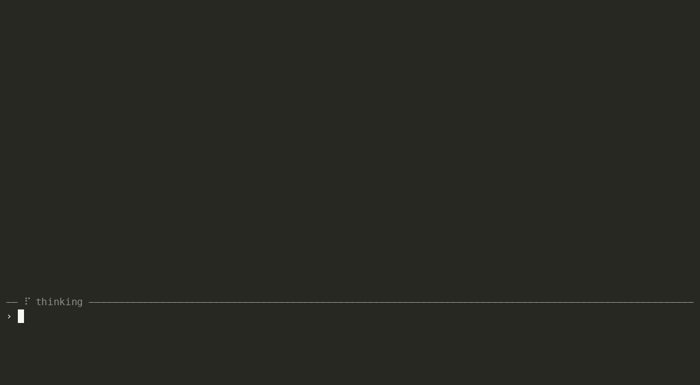

<div align="center">

# lean-coder

**A small terminal coding agent, dependency-free at its core, that treats context as the scarce resource it is.**

[](LICENSE)
[](https://www.python.org/downloads/)
-brightgreen.svg)


[Install](#install) &middot; [Quick start](#quick-start) &middot; [What it is](#what-it-is) &middot; [Providers](#providers) &middot; [Safety](#safety-two-axes) &middot; [Tools](#tools) &middot; [Context](#context-management)



<sub>A local model (Qwen3-Coder:30b via Ollama) auditing a Python package, finding the root cause of a bug, and fixing it.</sub>

</div>

## What it is

lean-coder reads, edits, and runs code in your project through a model's native
tool-calling API. It's built around one idea most agents ignore: **your context
window is the scarce resource, so don't waste it describing the tool.** Mainstream
agents spend tens of thousands of tokens on their own system prompt and tool
scaffolding before you type a word - and that's *before* any MCP servers, which add
[hundreds to thousands of tokens each](https://dev.to/kenimo49/your-mcp-server-eats-55000-tokens-before-your-agent-says-a-word-i-measured-the-real-cost-19l8)
on top. That's context that can't hold your actual code.

lean-coder's system prompt plus its **entire always-on tool surface costs ~2.5k
tokens** (a test enforces the ceiling). Turn on *every* optional bundled lean-tool at
once and the full surface is **~6k** - still less than a single
[typical MCP server](https://www.mindstudio.ai/blog/claude-code-mcp-server-token-overhead)
(~2k tokens, roughly lean-coder's whole always-on surface). The optional tools are off
by default and cost nothing until you enable them, so you pay only for what you
deliberately add.

And when a long task *does* fill the window, it doesn't truncate and forget. The agent
**documents its own work, pins a goal + plan, and hands over to a clean slate**, so the
job continues instead of dying mid-run. It's stdlib-only Python - the core is one
`curl`-and-run script with nothing to package, vendor, or compile - so the same tiny
codebase scales across the whole range:

- drive a **small local model** with a few thousand tokens of context - the ~2.5k
  baseline leaves room to actually work;
- point it at a **frontier model** and let it spawn parallel background workers on
  scoped sub-tasks, running a job far bigger than one context window;
- run it **on your phone in [Termux](https://termux.dev)** - it's just `python3`,
  nothing to compile;
- or **`/connect` to a beefier box over SSH** and run every tool *there* through a
  hermetic, secret-free executor, from the same terminal.

If your model handles MCP well, add all the servers you like on top - lean-coder is a
generic MCP client too. We just didn't want the platform *itself* to be the thing
eating your context. This is open source, built for the folks running local and open
models first. Core is one script (`lean_coder.py`) plus a required builtin-tools module
(`lean-tools/builtins.py`) and provider adapters in `providers/` (Ollama, llama.cpp,
MLX, Anthropic, Gemini, Groq, OpenAI, OpenRouter); it stays navigable because every
change has to pass three gates before it ships. See [CONTRIBUTING.md](CONTRIBUTING.md).

## Install

On Linux / WSL:

```bash
curl -fsSL https://raw.githubusercontent.com/codemonkeying/lean-coder/main/install.sh | bash
```

On Android / Termux:

```bash
pkg install -y python curl && curl -fsSL https://raw.githubusercontent.com/codemonkeying/lean-coder/main/install.sh | bash
```

The one-liner fetches `install.sh`, which installs the code and symlinks `lean_coder`
onto your `PATH`. On Termux there's no sudo/systemd, so it points you at a remote Ollama
(`lean_coder --host http://HOST:11434`). For a local Ollama on Linux, add
`--with-ollama --pull`. It's idempotent; `./uninstall.sh` does a full teardown.

Prefer to inspect first? Clone and run it in place with no install at all:

```bash
git clone https://github.com/codemonkeying/lean-coder
cd lean-coder
./install.sh --dry-run                          # show what it would do, change nothing
python3 lean_coder.py                            # or run in place: local Ollama, default model
python3 lean_coder.py --host http://box:11434 --model qwen3-coder:30b
```

**Requirements:** Python 3.11+ (uses stdlib `tomllib`); no third-party packages for the
core (a couple of opt-in lean-tools bring their own, e.g. `web_screenshot` needs
Playwright, and say so). Plus a tool-calling model behind a provider - **Ollama** works
out of the box, or a **hosted API** (Anthropic, Gemini, Groq, OpenAI, OpenRouter).

**Updating:** re-run the one-liner (or `git pull && ./install.sh`) any time. Or enable
the `update` lean-tool and run `/update` from the REPL: it pulls only a newer
`lean_coder.py` (`update_track` picks `stable` or `beta`); set `auto_update = true` to
check once at launch.

## Quick start

```bash
lean_coder                       # uses your config, or localhost Ollama + default model
```

You get an interactive REPL. Type a request; the agent reads, edits, and runs as
needed, **showing a diff before applying** and **confirming before running** shell
commands (unless approval is `session`/`auto`). Type `/help` for the full command list.

```
$ lean_coder
lean-coder  <your-model> @ <your-provider>
  cwd: ~/myproject   ·   baseline overhead (system + always-on tools): ~2.5k tokens
› add a --json flag to the export command and update the tests
● I'll look at the export command first.
  ⚙ read_file(path=src/export.py)
  ⚙ search_files(pattern=def export)
  ...
```

## Providers

A **provider** is the adapter that connects lean-coder to a model backend. **Ollama
ships bundled and default-enabled** - a fresh install talks to a local Ollama at
`localhost:11434` with zero config. To use a hosted API instead, several ship bundled
(disabled until you enable one and add a key):

| Provider        | Backend | Get a key |
|-----------------|---------|-----------|
| `ollama`        | Local / self-hosted Ollama (default) | none needed |
| `anthropic_api` | Anthropic API (Claude) | [console.anthropic.com](https://console.anthropic.com) |
| `gemini`        | Google Gemini | [aistudio.google.com](https://aistudio.google.com/apikey) |
| `groq`          | Groq (fast, free tier) | [console.groq.com](https://console.groq.com/keys) |
| `openai`        | OpenAI (gpt / o-series; paid) | [platform.openai.com](https://platform.openai.com/api-keys) |
| `openrouter`    | OpenRouter (gateway to many models) | [openrouter.ai](https://openrouter.ai/keys) |

**Setup is one step** - log in and paste your key:

```
/provider login anthropic_api      # prompts for the key, saves it, switches to it
```

That enables the backend, stores the key securely (a `chmod 600` file under
`~/.config/leancoder/`, **never** in `config.toml`), and makes it active. An env var
(e.g. `ANTHROPIC_API_KEY`, `GEMINI_API_KEY`) is picked up automatically instead if set.
Then `/provider` lists backends and switches between enabled ones; `/model` lists models
across every enabled provider and switches in one step. If a turn fails because a key is
missing or rejected, it offers the login prompt right there and retries.

To wire up any other backend, copy
[`examples/providers/example.py`](examples/providers/example.py) (an annotated
OpenAI-compatible template) into `providers/`; see [PROVIDER_API.md](PROVIDER_API.md).
Sessions are portable across providers (full history is re-sent each turn).

## Safety: two axes

**What it *can* do** and **whether it *asks*** are separate knobs that compose.

- **`/leash` - capability ceiling** (`chat` | `r` | `rw` | `rwe`, default `rwe`). Bounds
  the tools the model is even *given*:
  - `chat` - no tools at all (pure conversation).
  - `r` - **read-only**: read/list/search files. Safe to walk away from.
  - `rw` - read **+ edit files** (`apply_diff`, `write_file`).
  - `rwe` - read + edit **+ run shell commands** (full agent).

  The model is told its ceiling, so it says "I'm read-only; `/leash rw` to let me edit"
  rather than failing opaquely.
- **`/approve` - confirm cadence** (`ask` | `session` | `auto`, default `ask`). *When* to
  confirm within the ceiling:
  - `ask` - confirm every edit/command (you see a diff / the command first).
  - `session` - confirm once, then auto-approve the rest of this run.
  - `auto` - never ask (full autonomy).

Compose them: `leash r` = walk-away-safe analysis; `leash rw` + `approve auto` =
unattended editing; `leash rwe` + `approve auto` = full autonomy. The leash bounds what
the agent *attempts*; the **OS** (its file perms) bounds what it *can* do. Also:
**`/incognito`** writes nothing to disk for the run (and tells the model), and
**`/askread`** extends confirmation to read tools too.

## Tools

### The always-on set

Exposed via native tool calling. Descriptions are one line each, because they're
serialized into **every** request. Eight file/shell tools live in the required
builtin-tools module (`lean-tools/builtins.py`):

| Tool            | What it does |
|-----------------|--------------|
| `read_file`     | Line-numbered file contents; optional line range; large files truncated. |
| `list_files`    | Directory / shallow project tree, honoring ignore rules. |
| `search_files`  | Regex search -> `file:line` matches (capped). |
| `apply_diff`    | **Preferred edit tool.** SEARCH/REPLACE blocks - sends/returns only changed lines. |
| `replace_lines` | Replace a line range by number (simpler than a diff when you have the line numbers). |
| `write_file`    | Create or overwrite a whole file (mainly for new files). |
| `run_command`   | Run a foreground shell command in the project dir; stdout/stderr truncated. |
| `background`    | Run + manage long-lived tasks (dev servers, watchers, builds): `run` / `status` / `kill`, with optional notify/heartbeat/max-runtime watchdog. |

Alongside these the model always has **`update_plan`** (a pinned goal + TODO that
survives compaction) and **`note`** (a session notebook that travels with the session),
plus, by default, **`ask_user_to_run`** - the escape hatch for anything `run_command`
can't do: a command needing **sudo/root**, an **interactive prompt**, or a **typed
secret**. The agent hands the exact command back to *you*; only the command and its exit
code return, so **whatever you type never reaches the model**. Toggle it with `/set`. A
batch of read-only calls in one turn runs **concurrently**.

### Opt-in lean-tools

Anything beyond local edit + shell is a **lean-tool**: a single `.py` file with a `TOOL`
schema and a `run` function, discovered but **disabled by default**. Turn one on with
`/tools` and it costs context only from that point. These ship bundled in
[`lean-tools/`](lean-tools/):

| Lean-tool         | Adds |
|-------------------|------|
| `dispatch_worker` | Hand a scoped sub-task to a background worker agent; collect its result. Steer a running worker (inject / set plan / add notes), grant it a narrowed toolset, seed it with context, dispatch it against a named task `board`, and (with `worker_checkpoint` on) **resume** a worker that died. Adds `/worker`. |
| `board`           | A driver-orchestrated **task board**: a named dependency DAG the driver lays out and assigns workers to (workers report their own task `done`). Blocked tasks stay blocked; survives a crash on disk. Auto-enabled for a worker dispatched with `taskboard=`. |
| `web_fetch`       | Read a URL as clean text. |
| `web_screenshot`  | Screenshot a URL with a headless browser + return the page text (and, on a vision model, the image). **Needs [Playwright](https://playwright.dev/python/)**; says so if absent. |
| `brave_search`    | Web search (Brave API). |
| `git_summary`     | Read-only git snapshot (branch, status, diffstat, recent commits). |
| `diagnostics`     | Lint/typecheck with **whatever's already installed** (pyright, ruff, tsc, eslint, phpstan, clippy, shellcheck…), falling back to always-available basics (`py_compile`, `bash -n`, …). Zero deps of its own; never installs anything. |
| `symbols`         | Navigate Python code without grepping: outline a file/dir's classes+defs, or locate a definition by name (stdlib `ast`). |
| `shell_session`   | A persistent interactive shell held open across calls (REPL, ssh, etc.). |
| `ssh`             | One-shot `ssh host cmd` (network egress, kept out of core). |
| `notify`          | Desktop notification when a long task finishes. |
| `provision`       | `/provision` wizard: install lean-coder onto another box over SSH. |
| `update`          | `/update` - self-update `lean_coder.py` to the latest published build. |
| `word_count`      | Count lines / words / chars in a file. |

Almost all are stdlib-only. Two need a one-time setup and print the exact steps if
enabled without it: **`web_screenshot`** (Playwright + a browser) and **`brave_search`**
(a free [Brave Search API key](https://search.brave.com/app/keys) in
`~/.config/leancoder/brave.key` or `LEANCODER_BRAVE_KEY`). `diagnostics` uses external
linters if present but needs none. Every dep-bearing tool is off by default and says so
clearly if a dep is missing. Full notes in [LEAN_TOOLS.md](LEAN_TOOLS.md);
[`examples/lean-tools/`](examples/lean-tools/) has two annotated templates.

There's no persistent **LSP** integration - `diagnostics` (one-shot lint) and `symbols`
(`ast` navigation) cover day-to-day. If you'd use proper LSP, open an issue.

### MCP servers (Model Context Protocol)

lean-coder is a **generic MCP client**, builtin, with **no servers shipped by default**
(zero context until you add one). Point it at any MCP server and its tools join the
model's surface, namespaced `mcp__<server>__<tool>`:

```
/mcp add fs npx -y @modelcontextprotocol/server-filesystem /some/dir   # stdio server
/mcp add gw https://mcp-gateway.example.com/mcp/handbook/mcp           # HTTP server
/mcp                       # enable/disable menu (per server)
/mcp list                  # servers + connection state
/mcp reconnect [name]      # (re)connect
/mcp remove <name>
```

Two transports, both stdlib-only: **stdio** (a spawned subprocess, JSON-RPC over its
pipes) and **HTTP** (streamable MCP, tolerating SSE or plain-JSON). HTTP auth is one
`Authorization: Bearer` header: a static token/env, or an **OAuth 2.1**
client-credentials JWT fetched + cached + refreshed automatically (prefer OAuth 2.1
where the gateway offers it). For auth/env, edit the `mcp_servers` table in
`config.toml`:

```toml
[mcp_servers.gw]
transport = "http"
url = "https://mcp-gateway.example.com/mcp/handbook/mcp"
auth = { type = "bearer", token_env = "GW_KEY" }
# or: auth = { type = "oauth", token_url = "…/oauth/token", client_id = "…", client_secret_env = "GW_SECRET", scope = "mcp:access" }
```

MCP tools run on the **driver** (never a connected remote) and ride the **`rwe`** leash
tier, confirming like any non-safe tool unless approval is armed. Enabled servers connect
at launch; a dead one just contributes no tools. Full guide in [MCP.md](MCP.md).

### `apply_diff` format

The `diff` argument is one or more SEARCH/REPLACE blocks:

```
<<<<<<< SEARCH
exact existing text (must match the file verbatim)
=======
replacement text
>>>>>>> REPLACE
```

Blocks apply in order. If any SEARCH text isn't found, **nothing is written** and the
model is told to re-read and match exactly. The markers are word-bearing so a model
emits them reliably and they never collide with a plain row of `=` or a git conflict
marker.

## Context management

Every agentic turn re-sends the whole conversation, so lean-coder reclaims space at
several layers rather than letting it grow unchecked.

- **Truncation & ignore rules.** Large reads and command outputs are clipped head/tail
  with a clear `…[truncated N …]…` notice. Reads honor `.gitignore`, an optional
  `.leancoderignore`, and built-in defaults (`.git/`, `node_modules/`, `dist/`,
  `*.lock`, binaries…); ignored paths are never listed, searched, or walked.
- **Ingestion-time output caps.** Every tool result passes through one cap on the way in:
  a runaway `mcp.call` or lean-tool result is sized to a share of the free window (head +
  tail kept, middle marked) so no single result can blow the context. Results are born
  small rather than clawed back later.
- **`/trim [keep]`** stubs old tool results (file dumps, command output) to one-line
  placeholders, keeping the newest `keep` in full. No LLM call - the lighter lever,
  reclaiming the biggest consumer without touching the conversation or any edits. Fires
  manually or, in an emergency, automatically.
- **Budget meter.** After each turn a context-token figure (the real count from the
  provider when available, else an estimate) prints against the window, colored as it
  climbs. `/usage` reports it on demand; `/activity` replays what the system did on its
  own (compaction, trim, fallback, ingestion caps), so it's auditable, not magic.

### Compaction: documenting work before a memory wipe

Compaction is what keeps a long-running task alive. The insight: **the agent knows
what's in its own head**, so the moment to update documentation is *right before* that
memory is compacted, not after it's gone stale. On `/compact` (or automatically) the
model gets a full tool-capable turn to:

1. **Persist durable docs** - update whatever the project uses (design doc, README,
   notes) and commit them if it's a git repo.
2. **Write a summary for its future self** - goal, key decisions, current state (done /
   in progress / next), where the durable docs live, and a prompt to continue from.
3. **Pin a goal + TODO** that survives the wipe.
4. **Write a self-prompt** - the single next instruction.

The older conversation is then replaced with just that summary block (the most recent
turns kept verbatim - a "smart `/clear`" that keeps the thread), and unless disabled the
self-prompt is **fed back in as the next turn**, so the agent continues from a clean
slate (a 5-second `^C`-to-cancel beat precedes it). That's how a task outruns the window
while its docs stay current.

It runs itself in **tiers** as context fills: a **soft zone (~70%)** nudges it to wrap up
at a clean break and compact tidily; a **hard threshold (~90%)** forces a compaction at a
boundary; an **emergency stop (~100%)** compacts immediately. A loop guard (~1/min) stops
a compact->continue->compact spin, and after a compaction the last few turns are kept
verbatim (`compact_keep`, default 3). The single lever is **`compact_at`** (via `/set`) -
the fill fraction at which it compacts; the soft-nudge zone auto-follows below it.
`auto_compact`, `autostart_after_compact`, `compact_emergency`, and the prompts
themselves are all tunable per model.

- **Autonomous wake on background finish (off by default).** With `wake_on_bg_finish =
  true`, a finished background task or worker wakes the agent with a synthesised turn so
  it reacts with no operator input; otherwise the notice waits for your next turn. A
  single job can opt in via `run_command`'s `notify_on_exit` / `heartbeat_timeout` /
  `max_runtime` args even when the global setting is off.
- **Bounded send-window (off by default).** For a very small local model, even the
  compaction flow can be too much history. `window_messages = N` caps each request to the
  last N messages, cut at a *whole-turn boundary* so the current task is never truncated -
  a hard token bound every turn, at the cost of the model seeing only recent turns. Most
  models are better served leaving this off and letting compaction manage size.

## Configuration

Precedence: **CLI flag > env var > config file > default**.

| Setting         | Flag                   | Env               | Default                   |
|-----------------|------------------------|-------------------|---------------------------|
| Ollama endpoint | `--host`               | `OLLAMA_HOST`     | `http://localhost:11434`  |
| Model           | `--model`              | `LEANCODER_MODEL` | `qwen3-coder:30b`         |
| Context window  | `--num-ctx`            | -                 | auto-detect, capped 32768 |
| Project dir     | `--cwd`                | -                 | current directory         |
| Approval mode   | `--approval` / `--auto`| -                 | `ask` (confirm each)      |
| Capability      | `--leash`              | -                 | `rwe`                     |
| Resume session  | `--resume <name>`      | -                 | auto-load last for cwd    |

Config lives in `~/.config/leancoder/config.toml` and **autosaves**: any change (`/set`,
`/model`, `/provider`, `/approve`, …) is written back immediately. It also supports
tiered host failover, memorable machine names, per-machine default models, and saved
`/connect` targets. **Context auto-detection:** without `--num-ctx` (and when
`auto_num_ctx` is on), lean-coder reads the model's window from the provider at startup;
auto-detect only ever *lowers* the window (capped 32768), so pass `--num-ctx` to go
higher explicitly.

## Slash commands

```
/clear             wipe conversation, stay in this session
/new [name]        start a separate session
/trim [keep]       stub old tool outputs, keep newest [keep] in full (no LLM)
/compact           agent commits durable docs, writes a future-self summary, replaces history
/save [name]       name the current session
/load [name]       resume a session (no arg = picker)
/session           list | delete <name>
/prompt [name]     view/edit prompt files (/prompt use <name> = fire one as a turn)
/sh [cmd]          run a command yourself in a terminal (no arg = your $SHELL)
/connect [host]    run tools on a remote box over SSH (no arg = pick saved/open)
/local [host]      detach the active remote (keep it open to switch back)
/machines          manage saved remote hosts (list/add/remove)
/tools             enable/disable lean-tools
/mcp               manage MCP servers (add/remove/reconnect; no arg = enable/disable menu)
/reload            reload lean-tools + pick up prompt edits
/model [name]      switch model across enabled providers (no arg = list)
/provider [name]   switch/manage the model provider
/usage             session tokens + context / provider usage
/think [level]     set thinking level (no arg = menu)
/effort [level]    set reasoning effort (no arg = menu)
/set [key val]     edit app config (config.toml knobs; no arg = menu)
/provider set [k v] get/set a backend-specific provider knob
/approve [mode]    confirm cadence: ask | session | auto
/leash [level]     capability ceiling: chat | r | rw | rwe
/autosave [on|off] autosave + auto-load last on start
/incognito [on|off]don't save the session locally
/askread [on|off]  confirm read tools too
/bg [kill <pid>]   list/kill background tasks
/info              live session read-out
/activity [n|all]  what the system did automatically (compaction, trim, fallback, …)
/expand [N]        show a tool call's full (untruncated) args
/help              list commands
/quit              exit
```

Any command answers **`/<cmd> ?`** (or `/<cmd> help`) with its own detailed help. When
stdlib `readline` is available, **Tab** completes commands and their arguments and you
get line history; menu pickers (`/set`, `/model`, `/think`, …) are arrow-key navigable
with type-to-filter, falling back to a numbered prompt when headless.

**Editable prompts:** `/prompt` opens the prompt files in your editor. The built-ins
(`system`, `compact`, `auto_compact`, `compact_nudge`) can be tuned and take effect live
(`/prompt reset <name>` reverts). You can also save your **own** named prompts and fire
one as a one-shot turn with **`/prompt use <name>`** - handy for a refactor brief, a
review checklist, or a commit-message style.

## Remote workspace

`/connect <[user@]host> [path]` runs lean-coder's tools on a remote box over SSH. Every
file/exec tool then runs *there*, on the remote's filesystem, while the model's tool
surface stays identical. The prompt shows `[remote: host] ›` so you always know where you
are.

- **No install on the remote beyond `python3`** - the script is pushed into throwaway
  space; the push is hash-skipped when a matching build is already there.
- **The executor is hermetic:** no config, no model, no secrets, no network egress - it
  only runs approved tool calls against the one directory.
- **Confirmations stay local:** the preview and `y/N` happen on your machine; remote
  edits still show a real unified diff.
- Auth happens once via a multiplexed SSH master socket; none of the connection/install
  output ever enters the model's context.

Because `/connect` moves only the *executor*, a single saved session can drive your
laptop one moment and a remote box the next without losing a thing. Sessions autosave
each turn and the last one auto-loads on start.

## Agent loop

1. Build messages: `[system] + history + latest turn`; attach the tools.
2. Stream a chat completion from the provider.
3. If the reply has tool calls, execute each, append each result as a `tool` message, and
   loop.
4. Content with no tool calls is the final answer.
5. Capped tool rounds per turn prevent runaway loops.

A batch of tool calls that are **all read-only** runs concurrently (wall time = the
slowest call); any batch containing a writer or command runs sequentially, and a
connected session is always sequential. Results are appended in call order.

## Development

Three gates, run bare from the repo root (each exits non-zero on failure):

```bash
python3 tests/_smoketest.py     # offline unit suite (incl. the fixed-overhead budget check)
python3 tests/_mocktest.py      # scripted end-to-end suite
bash tests/_sweep.sh            # hygiene lint (stray unicode, likely secrets/PII, etc.)
```

See [CONTRIBUTING.md](CONTRIBUTING.md) for the bar, [LEAN_TOOLS.md](LEAN_TOOLS.md) for
writing tools, and [PROVIDER_API.md](PROVIDER_API.md) for providers.

## License

[MIT](LICENSE).
